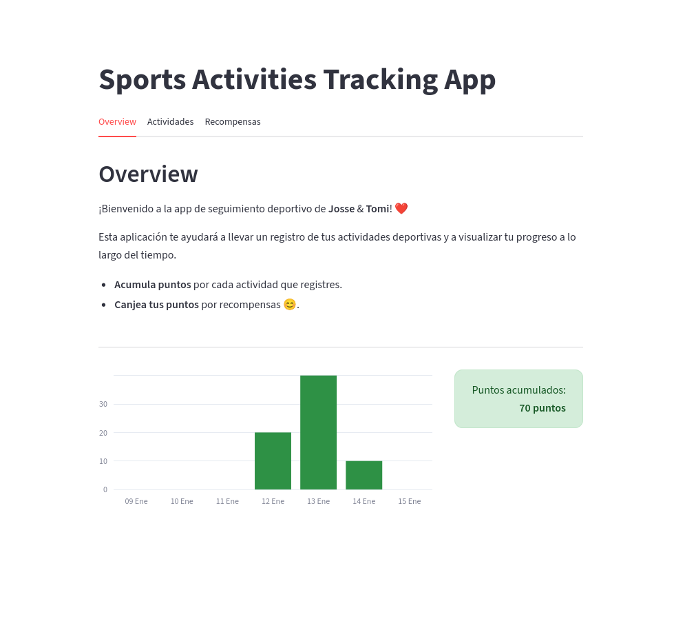

# Sports Activities Tracking App

Aplicación minimalista para el registro y seguimiento de actividades deportivas, pensada para uso personal o en grupo.

## Características

- Registro de actividades deportivas con puntaje personalizado.
- Visualización de progreso semanal con gráficos.
- Sistema de recompensas canjeables por puntos acumulados.
- Interfaz amigable y moderna usando Streamlit.

## Captura de pantalla



## Instalación

1. Clona este repositorio:
   ```bash
   git clone https://github.com/tcaballero95/sports_app.git
   cd sports_app
   ```
2. (Opcional) Crea y activa un entorno virtual o conda:
   ```bash
   conda create -n sports_app_env python=3.14
   conda activate sports_app_env
   ```
3. Instala las dependencias:
   ```bash
   pip install -r requirements.txt
   ```

## Uso

Ejecuta la aplicación con:

```bash
streamlit run app.py
```

## Estructura de archivos

- `app.py`: Código principal de la aplicación Streamlit.
- `actividades.json`: Lista de actividades y puntajes.
- `recompensas.json`: Lista de recompensas y puntos requeridos.
- `registro_actividades.json`: Registro histórico de actividades.
- `registro_recompensas.json`: Registro histórico de canjes.
- `requirements.txt`: Dependencias del proyecto.

## Personalización

- Puedes editar los archivos JSON para agregar/quitar actividades y recompensas.
- El puntaje y las recompensas son totalmente configurables.

## Dependencias principales

- streamlit
- pandas
- plotly

Consulta `requirements.txt` para la lista completa.

---
